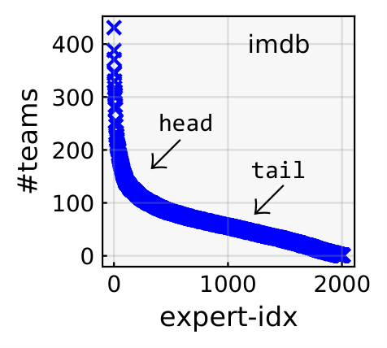

# ``Adila``<sup>*</sup>: Fairness-Aware Team Formation
<sup>*[ عادلة, feminine Arabic given name, meaning just and fair](https://en.wikipedia.org/wiki/Adila_(name))<sup>

`Team Formation` aims to automate forming teams of experts who can successfully solve difficult tasks. While state-of-the-art neural team formation methods are able to efficiently analyze massive collections of experts to form effective collaborative teams, they largely ignore the fairness in recommended teams of experts. Fairness breeds innovation and increases teams' success by enabling a stronger sense of community, reducing conflict, and stimulating more creative thinking. In `Adila`, we study the application of `fairness-aware` team formation algorithms to mitigate the potential popularity bias in the neural team formation models. Our experiments show that, first, neural team formation models are biased toward popular experts. Second, although deterministic re-ranking algorithms mitigate popularity bias substantially, they severely hurt the efficacy of teams.

> We have studied the application of state-of-the-art [`deterministic greedy re-ranking methods [Geyik et al. KDD'19]`](https://dl.acm.org/doi/10.1145/3292500.3330691) to mitigate `populairty bias` based on `equality of opportunity` for state-of-the-art neural team formation methods from [`OpeNTF`](https://github.com/fani-lab/opeNTF/). Our experiments show that:
> - Neural team formation models are biased toward popular experts;
> - Although deterministic re-ranking algorithms mitigate popularity bias substantially, they severely hurt the efficacy of teams. 

> Currently, we are investigating:
> - Other fairness factors like demographic attributes, including age, race, and gender; 
> - Developing machine learning-based models using Learning-to-Rank (L2R) techniques to mitigate popularity bias as opposed to deterministic greedy algorithms.

1. [Setup](#1-setup)
2. [Quickstart](#2-quickstart)
3. [Pipeline](#3-pipeline)
4. [Result](#4-result)
5. [Acknowledgement](#5-acknowledgement)
6. [License](#6-license)  
7. [Citation](#7-citation)

## 1. Setup
`Adila` needs ``Python=3.8`` and others packages listed in [``requirements.txt``](requirements.txt):

By ``pip``, clone the codebase and install the required packages:
```sh
git clone https://github.com/Fani-Lab/Adila
cd Adila
pip install -r requirements.txt
```

By [``conda``](https://www.anaconda.com/products/individual):

```sh
git clone https://github.com/Fani-Lab/Adila
cd Adila
conda env create -f environment.yml
conda activate adila
```

## 2. Quickstart
To run `Adila`, you can use [./src/main.py](./src/main.py):

```bash
cd src
python -u main.py \
  -fteamsvecs ../data/preprocessed/dblp/toy.dblp.v12.json/teamsvecs.pkl \
  -fsplit ../output/toy.dblp.v12.json/splits.json \
  -fpred ../output/toy.dblp.v12.json/bnn/ \
  -np_ratio 0.5 \
  -reranker det_cons \
  -output ../output/toy.dblp.v12.json/
```

Where the arguements are:

  > `fteamsvecs`: the sparse matrix representation of all teams in a pickle file, including the teams whose members are predicted in `--pred`. It should contain a dictionary of three `lil_matrix` with keys `[id]` of size `[#teams × 1]`, `[skill]` of size `[#teams × #skills]`, `[member]` of size `[#teams × #experts]`. Simply, each row of a metrix shows the occurrence vector of skills and experts in a team. For a toy example, try 
  ```
  import pickle
  with open(./data/preprocessed/dblp/toy.dblp.v12.json/teamsvecs.pkl) as f: teams=pickle.load(f)
  ```
  
  > `fsplit`: the split.json file that indicates the index (rowid) of teams whose members are predicted in `--pred`. For a toy example, see [`output/toy.dblp.v12.json/splits.json`](output/toy.dblp.v12.json/splits.json)  

  > `fpred`: a file or folder that includes the prediction files of a neural team formation methods in the format of `torch.ndarray`. The file name(s) should be `*.pred` and the content is `[#test × #experts]` probabilities that shows the membership probability of an expert to a team in test set. For a toy example, try 
  ```
  import torch
  torch.load(./output/toy.dblp.v12.json/bnn/t31.s11.m13.l[100].lr0.1.b4096.e20.s1/f0.test.pred)
  ```     

  > `np_ratio`: the desired `nonpopular` ratio among members of predicted teams after mitigation process by re-ranking algorithms. E.g., 0.5.
  
  > `reranker`: fairness-aware reranking algorithm from {`det_greedy`, `det_cons`, `det_relaxed`}. Eg. `det_cons`.  

  > `output`: the path to the reranked predictions of members for teams, as well as, the teams' success and fairness evaluation `before` and `after` mitigation process.

## 3. Pipeline

`Adila` needs preprocessed information about the teams in the form of sparse matrix representation (`-fteamsvecs`) and neural team formation prediction file(s) (`-fpred`), obtained from [`OpeNTF`](https://github.com/fani-lab/OpeNTF/tree/main):

```bash
├── data
│   └── preprocessed
│       └── dblp
│           └── toy.dblp.v12.json
│               └── teamsvecs.pkl     #sparse matrix representation of teams
├── output
    └── toy.dblp.v12.json
        ├── bnn
        │   └── t31.s11.m13.l[100].lr0.1.b4096.e20.s1
        │       ├── f0.test.pred
        │       ├── f1.test.pred
        │       ├── f2.test.pred
        └── splits.json #rowids of team instances in n-fold train-valid splits, and a final test split
```

Then, it go thourgh the pipeline as shown in the figure:


As seen, `Adila` has three main steps:

### 3.1. Labeling

Based on the distribution of experts on teams, which is power law (long tail) as shown in the figure, we label those in the `tail` as `nonpopular` and those in the `head` as popular. 
<p align="center"></p>

To find the cutoff between `head` and `tail`, we calculate the average number of teams per expert over the whole dataset. As seen in the table, this number is `62.45` and the popular/nonpopular ratio is `0.426/0.574`.  The result is a Boolean value in `{popular: True, nonpopular: False}` for each expert and is save in `{output}/popularity.csv` like [`./output/toy.dblp.v12.json/bnn/t31.s11.m13.l[100].lr0.1.b4096.e20.s1/rerank/popularity.csv`](./output/toy.dblp.v12.json/bnn/t31.s11.m13.l[100].lr0.1.b4096.e20.s1/rerank/popularity.csv) 
 
|             imdb                       |     |          |
|------------------------------------|:-------:|:--------:|
|                                    |   raw   | filtered |
| #movies                           | 507,034 |  32,059  |
| #unique casts and crews           | 876,981 |   2,011  |
| #unique genres                    |    28   |    23    |
| average #casts and crews per team |   1.88  |   3.98   |
| average #genres per team          |   1.54  |   1.76   |
| average #movie per cast and crew  |   1.09  |   62.45  |
| average #genre per cast and crew  |   1.59  |   10.85  |
| #team w/ single cast and crew     | 322,918 |     0    |
| #team w/ single genre             | 315,503 |  15,180  |
  
`Future:` We will consider equal area under the curve for the cutoff.
   
### 3.2. Reranking 
  
We apply rerankers from [`deterministic greedy re-ranking methods [Geyik et al. KDD'19]`](https://dl.acm.org/doi/10.1145/3292500.3330691), including `{'det_greedy', 'det_cons', 'det_relaxed'}` to mitigate `populairty bias`. The reranker needs a cutoff `k_max` which is set to `10` by default. 

The result of predictions after reranking is saved in `{output}/rerank/{fpred}.{reranker}.{k_max}.rerank.pred` like [`./output/toy.dblp.v12.json/bnn/t31.s11.m13.l[100].lr0.1.b4096.e20.s1/rerank/f0.test.pred.det_cons.10.rerank.pred`](./output/toy.dblp.v12.json/bnn/t31.s11.m13.l[100].lr0.1.b4096.e20.s1/rerank/f0.test.pred.det_cons.10.rerank.pred) .

### 3.3. Evaluations 
  
We evaluate `fairness` and `utility` metrics `before` and `after` applying rerankers on team predictions to answer two research questions (RQs):
    
**`RQ1:`** Do state-of-the-art neural team formation models produce fair teams of experts in terms of popularity bias? To this end, we measure the fairness scores of predicted teams `before` applying rerankers. 
    
**`RQ2:`** Do state-of-the-art deterministic greedy re-ranking algorithms improve the fairness of neural team formation models while maintaining their accuracy? To this end, we measure the `fairness` and `utility` metrics `before` and `after` applying rerankers.
    
The result of `fairness` metrics `before` and `after` will be stored in `{output}.{algorithm}.{k_max}.{faireval}.csv` like [`./output/toy.dblp.v12.json/bnn/t31.s11.m13.l[100].lr0.1.b4096.e20.s1/rerank/f2.test.pred.det_cons.10.faireval.csv`](./output/toy.dblp.v12.json/bnn/t31.s11.m13.l[100].lr0.1.b4096.e20.s1/rerank/f2.test.pred.det_cons.10.faireval.csv) .
    
The result of `utility` metrics `before` and `after` will be stored in `{output}.{algorithm}.{k_max}.{utileval}.csv` like [`./output/toy.dblp.v12.json/bnn/t31.s11.m13.l[100].lr0.1.b4096.e20.s1/rerank/f1.test.pred.det_cons.10.utileval.csv`](./output/toy.dblp.v12.json/bnn/t31.s11.m13.l[100].lr0.1.b4096.e20.s1/rerank/f1.test.pred.det_cons.10.utileval.csv).
   
`Future:` We will consider other fairness metrics.

After successful run of all steps, [`./output`](./output) contains:

```bash
├── output
    └── toy.dblp.v12.json
        ├── bnn
        │   └── t31.s11.m13.l[100].lr0.1.b4096.e20.s1
        │       ├── f0.test.pred
        │       ├── f1.test.pred
        │       ├── f2.test.pred
        │       └── rerank
        │           ├── f0.test.pred.det_cons.10.faireval.csv
        │           ├── f0.test.pred.det_cons.10.utileval.csv
        │           ├── f0.test.pred.det_cons.10.rerank.csv
        │           ├── f0.test.pred.det_cons.10.rerank.pred
        │           ├── f1.test.pred.det_cons.10.faireval.csv
        │           ├── f1.test.pred.det_cons.10.utileval.csv
        │           ├── f1.test.pred.det_cons.10.rerank.csv
        │           ├── f1.test.pred.det_cons.10.rerank.pred
        │           ├── f2.test.pred.det_cons.10.faireval.csv
        │           ├── f2.test.pred.det_cons.10.utileval.csv
        │           ├── f2.test.pred.det_cons.10.rerank.csv
        │           ├── f2.test.pred.det_cons.10.rerank.pred
        │           ├── popularity.csv
        │           ├── rerank.time
        │           └── stats.pkl
        └── splits.json
```

## 4. Result
Our results show that although we improve fairness significantly, our utility metric drops extensively. Part of this phenomenon is described in [`Fairness in Ranking, Part I: Score-Based Ranking [Zehlike et al. ACM Computing Surveys'22]`](https://dl.acm.org/doi/full/10.1145/3533379). When we apply representation constraints on individual attributes, like race , popularity and gender and we want to maximize a score with respect to these constraints, utility loss can be particularly significant in historically disadvantaged intersectional groups. The following tables contain the results of our experiments on the `bnn`, `bnn_emb` and `random` baselines with `greedy`, `conservative` and `relaxed` re-ranking algorithms.
| [``bnn(3.8 GB)``](https://uwin365-my.sharepoint.com/:f:/g/personal/ghasrlo_uwindsor_ca/Ej41Qn2GHytKhKpbyuiwLCABgUFOll74nBndOxQbDnLVMA?e=WtzNpd) |         |                |             |                |             |                |                      |
|:-----------------------------------------------------:|:-------:|:--------------:|:-----------:|:--------------:|:-----------:|:--------------:|:--------------------:|
|                                                       |         |     greedy     |             |  conservative  |             |     relaxed    |                      |
|                                                       |  before | after | $\Delta$ | after | $\Delta$ | after | $\Delta$ |
|                ndcg2 &uarr;               | 0.695% |     0.126%    |   -0.569%  |     0.091%    |   -0.604%  |     0.146%    |       -0.550%       |
|                ndcg5 &uarr;               | 0.767% |     0.141%    |   -0.626%  |     0.130%    |   -0.637%  |     0.130%    |       -0.637%       |
|               ndcg10 &uarr;               | 1.058% |     0.247%    |   -0.811%  |     0.232%    |   -0.826%  |     0.246%    |       -0.812%       |
|                map2 &uarr;                | 0.248% |     0.060%    |   -0.188%  |     0.041%    |   -0.207%  |     0.063%    |       -0.185%       |
|                map5 &uarr;                | 0.381% |     0.083%    |   -0.298%  |     0.068%    |   -0.313%  |     0.079%    |       -0.302%       |
|                map10 &uarr;               | 0.467% |     0.115%    |   -0.352%  |     0.101%    |   -0.366%  |     0.115%    |       -0.352%       |
|               ndlkl &darr;             |  0.2317 |     0.0276     |   -0.2041   |     0.0276     |   -0.2041   |     0.0273     |        -0.2043       |

| [``bnn_emb(3.79 GB)``](https://uwin365-my.sharepoint.com/:f:/g/personal/ghasrlo_uwindsor_ca/El75TMyU4D1Dt39_yLacGxYBSF2a4ntnyiZ7vq4rLy8dCg?e=skz450) |         |                |             |                |             |                |                      |
|:----------------------------------------------------------:|:-------:|:--------------:|:-----------:|:--------------:|:-----------:|:--------------:|:--------------------:|
|                                                            |         |     greedy     |             |  conservative  |             |     relaxed    |                      |
|                                                            |  before | after | $\Delta$ | after | $\Delta$ | after | $\Delta$ |
|                  ndcg2 &uarr;                  | 0.921% |     0.087%    |   -0.834%  |     0.121%    |   -0.799%  |     0.087%    |       -0.834%       |
|                  ndcg5 &uarr;                  | 0.927% |     0.117%    |   -0.810%  |     0.150%    |   -0.777%  |     0.117%    |       -0.810%       |
|                  ndcg10 &uarr;                 | 1.266% |     0.223%    |   -1.043%  |     0.241%    |   -1.025%  |     0.223%    |       -1.043%       |
|                  map2 &uarr;                  | 0.327% |     0.034%    |   -0.293%  |     0.057%    |   -0.270%  |     0.034%    |       -0.293%       |
|                  map5 &uarr;                  | 0.469% |     0.059%    |   -0.410%  |     0.084%    |   -0.386%  |     0.059%    |       -0.410%       |
|                  map10 &uarr;                  | 0.573% |     0.093%    |   -0.480%  |     0.111%    |   -0.461%  |     0.093%    |       -0.480%       |
|                  ndkl &darr;                |  0.2779 |     0.0244     |   -0.2535   |     0.0244     |   -0.2535   |     0.0241     |        -0.2539       |

|           [``random(2.41 GB)``](https://uwin365-my.sharepoint.com/:f:/g/personal/ghasrlo_uwindsor_ca/EkTgR0AjvIpNvz0Vsu-JwwoBMxl4kJsZxJBUI0zdQUxcTw?e=VYC66y)          |          |                |             |                |             |                |                      |
|:-------------------------:|:--------:|:--------------:|:-----------:|:--------------:|:-----------:|:--------------:|:--------------------:|
|                           |          |     greedy     |             |  conservative  |             |     relaxed    |                      |
|                           |  before  | after | $\Delta$ | after | $\Delta$ | after | $\Delta$ |
|  ndcg2 &uarr;  | 0.1711% |     0.136%    |   -0.035%  |     0.205%    |   0.034%   |     0.205%    |        0.034%       |
|  ndcg5 &uarr;  | 0.1809% |     0.170%    |   -0.011%  |     0.190%    |   0.009%   |     0.190%    |        0.009%       |
| ndcg10 &uarr;  | 0.3086% |     0.258%    |   -0.051%  |     0.283%    |   -0.026%  |     0.283%    |       -0.026%       |
|  map2 &uarr;   | 0.0617% |     0.059%    |   -0.003%  |     0.089%    |   0.028%   |     0.089%    |        0.028%       |
|  map5 &uarr;   | 0.0889% |     0.095%    |   0.006%   |     0.110%    |   0.021%   |     0.110%    |        0.021%       |
|  map10 &uarr;  | 0.1244% |     0.121%    |   -0.003%  |     0.140%    |   0.016%   |     0.140%    |        0.016%       |
| ndkl &darr; |  0.0072  |     0.0369     |    0.0296   |     0.0366     |    0.0293   |     0.0366     |        0.0294        |
  
## 5. Acknowledgement
We benefit from [``pytrec``](https://github.com/cvangysel/pytrec_eval), [``reranking``](https://github.com/yuanlonghao/reranking), and other libraries. We would like to thank the authors of these libraries and helpful resources.
  
## 6. License
©2023. This work is licensed under a [CC BY-NC-SA 4.0](license.txt) license.

Hamed Loghmani<sup>1</sup>, [Hossein Fani](https://hosseinfani.github.io/)<sup>1,2</sup> 

<sup><sup>1</sup>School of Computer Science, Faculty of Science, University of Windsor, ON, Canada.</sup>
<sup><sup>2</sup>[hfani@uwindsor.ca](mailto:hfani@uwindsor.ca)</sup>

## 7. Citation
```
@inproceedings{DBLP:conf/bias/LoghmaniF23,
  author    = {Hamed Loghmani and Hossein Fani},
  title     = {Bootless Application of Greedy Re-ranking Algorithms in Fair Neural Team Formation},
  booktitle = {Advances in Bias and Fairness in Information Retrieval - Fourth International Workshop, {BIAS} 2023, Dublin, Irland, April 2, 2023, Revised Selected Papers},
  publisher = {Springer},
  year      = {2023},
  bibsource = {dblp computer science bibliography, https://dblp.org}
}
```

