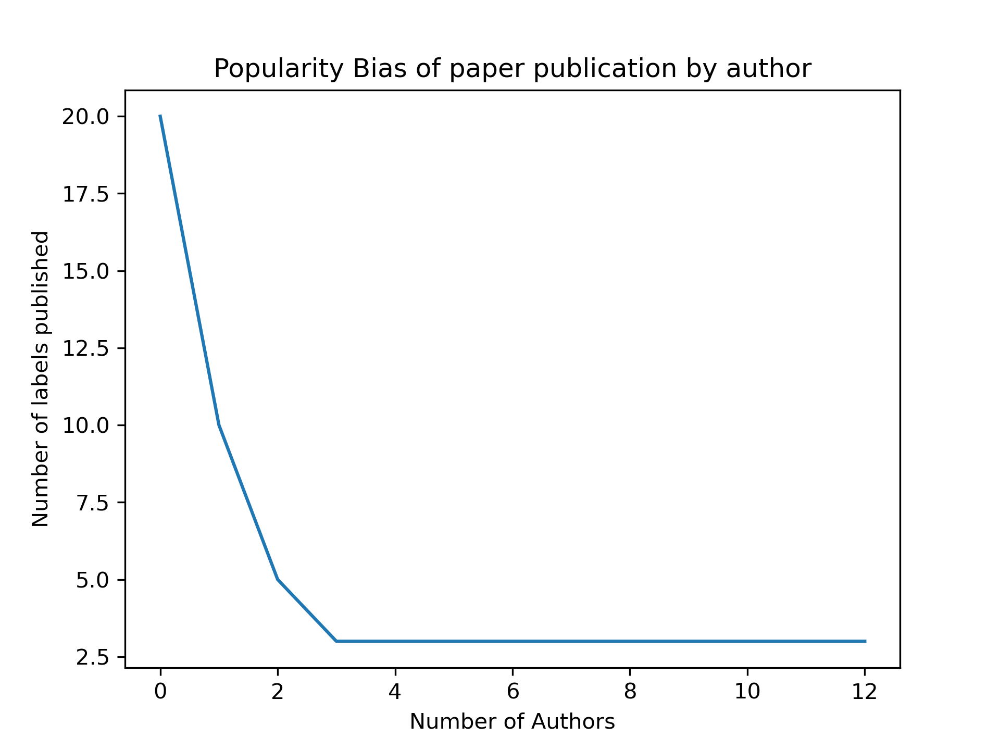

# Fair Team Formation
Many recommender systems suffer from popularity bias, in which popular items are regularly recommended whereas less popular, specialised products are rarely or never recommended. The same problem can happen in team formation. Our goal is to form teams in a way that every qualified person gets equal chance to be a member of a team since already existing team formation algorithms give more opportunity to the more popular people, which in our work means those who have more publications previously. We are aware that a person with more published papers has more experience, but the problem in this case is, more and more opportunities will be given to popular authors while there might be authors as qualified as those with less chance to work in these teams. Therefore, we aim to make teams in which every qualified candidate has the same opportunity to be chosen as a member. The long- tail phenomenon in our simulated dataset derived from DBLP is shown below.

## Setup
using the [starter.ipynb](./starter.ipynb). Basic setup to run our project.

## results
Metric  | Mean
------------- | -------------
P_2  | 0.400000000000000
P_5  | 0.360000000000000
P_10  | 0.240000000000000
recall_2  | 0.316666666666667
recall_5  | 0.716666666666667
recall_10  | 0.950000000000000
ndcg_cut_2  | 0.309482245787633
ndcg_cut_5  | 0.497449381433493
ndcg_cut_10  | 0.605848208191883
map_cut_2  | 0.158333333333333
map_cut_5  | 0.352500000000000
map_cut_10  | 0.436626984126984
aucroc  | 0.678254437869823

## Future work

Running it on the final DBLP test dataset.