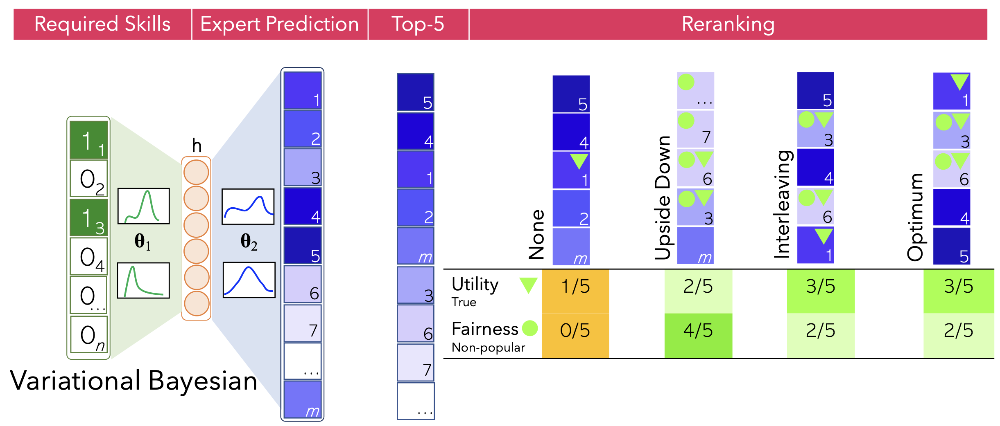
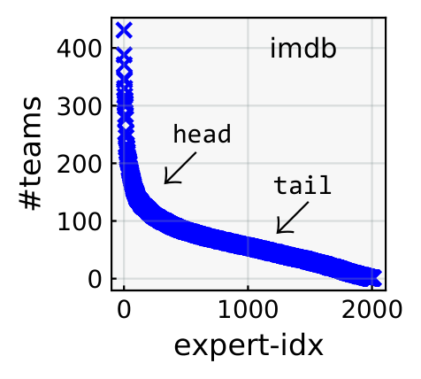
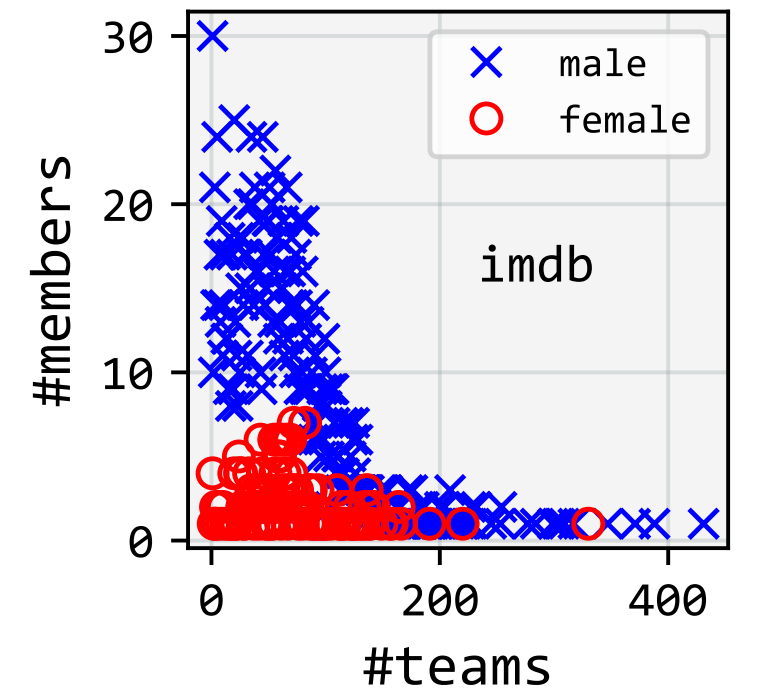
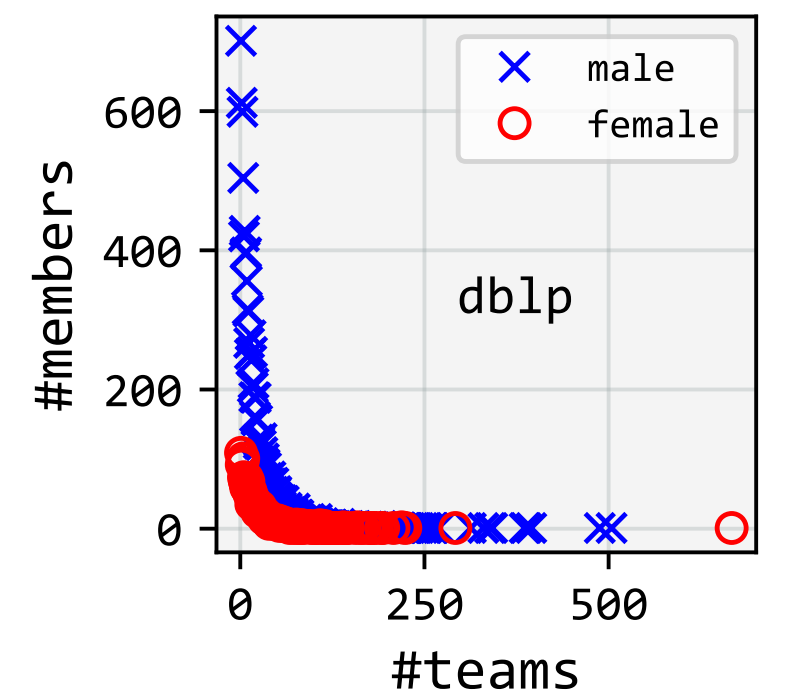
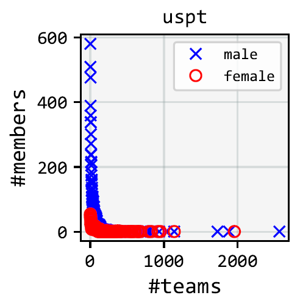

# ``Adila``<sup>*</sup>: Fairness-Aware Team Recommendation 
<sup>*[ عادلة, feminine Arabic given name, meaning just and fair](https://en.wikipedia.org/wiki/Adila_(name))<sup>

 [](https://creativecommons.org/licenses/by-nc-sa/4.0/) [](https://github.com/fani-lab/Adila/actions)

<sub>

 ---
 
> 2026, COIN, A Probabilistic Greedy Attempt to be Fair in Neural Team Recommendation. [`pdf`](https://hosseinfani.github.io/res/papers/2026_COIN_A_Probabilistic_Greedy_Attempt_to_be_Fair_in_Neural_Team_Recommendation.pdf) [`doi`](https://onlinelibrary.wiley.com/doi/10.1111/coin.70221) [`major`](https://hosseinfani.github.io/res/papers/2026_COIN_R1_A_Probabilistic_Greedy_Attempt_to_be_Fair_in_Neural_Team_Recommendation.pdf) [`minor`](https://hosseinfani.github.io/res/papers/2026_COIN_R2_A_Probabilistic_Greedy_Attempt_to_be_Fair_in_Neural_Team_Recommendation.txt)

> 2023, BIAS-ECIR, Bootless Application of Greedy Re-ranking Algorithms in Fair Neural Team Formation. [`pdf`](https://hosseinfani.github.io/res/papers/2023_BIAS_ECIR_Bootless_Application_of_Greedy_Re-ranking_Algorithms_in_Fair_Neural_Team_Formation.pdf) [`doi`](https://doi.org/10.1007/978-3-031-37249-0_9) [`reviews`](https://hosseinfani.github.io/res/papers/2023_BIAS_ECIR_Bootless_Application_of_Greedy_Re-ranking_Algorithms_in_Fair_Neural_Team_Formation.txt) [`video`](https://www.youtube.com/watch?v=EmAFvANqzBM)

---

</sub>

`Team Recommendation` aims to automate forming teams of experts who can collaborate and successfully solve tasks. While state-of-the-art methods are able to efficiently analyze massive collections of experts to recommend effective collaborative teams, they largely ignore the fairness in the recommended experts; our experiments show that they are biased toward `popular` and `male` experts. In `Adila`, we aim to mitigate the potential biases for fair team recommendation. Fairness breeds innovation and increases teams' success by enabling a stronger sense of community, reducing conflict, and stimulating more creative thinking. 

We have studied the application of state-of-the-art [`deterministic greedy re-ranking methods [Geyik et al. KDD'19]`](https://dl.acm.org/doi/10.1145/3292500.3330691) in addition to [`probabilistic greedy re-ranking methods [Zehlike et al. IP&M'22]`](https://dl.acm.org/doi/abs/10.1016/j.ipm.2021.102707)to mitigate `populairty bias` and `gender bias` based on `equal opportunity` and `demographic parity` notions of fairness for state-of-the-art neural team formation methods from [`OpeNTF`](https://github.com/fani-lab/opeNTF/). Our experiments show that:
> Although deterministic re-ranking algorithms mitigate `popularity` xor `gender` bias, they hurt the efficacy of teams, i.e., higher fairness metrics yet lower utility metrics (successful team)

> Probabilistic greedy re-ranking algorithms mitigate `popularity` bias significantly and maintain utility. Though in terms of `gender`, such algorithms fail due to extreme bias in a dataset. 

Currently, we are investigating:
> Other fairness factors like demographic attributes, including `age`, and `race`; 

> Developing machine learning-based models using Learning-to-Rank (L2R) techniques to mitigate bias as opposed to deterministic greedy algorithms.

- [1. Setup](#1-setup)
- [2. Quickstart](#2-quickstart)
- [3. Pipeline](#3-pipeline)
  * [3.1. Popularity](#31-popularity)
  * [3.2. Gender](#32-gender)
  * [3.3. Reranking](#33-reranking)
  * [3.4. Evaluations](#34-evaluations)
- [4. Acknowledgement](#4-acknowledgement)
- [5. License](#5-license)

## 1. Setup
`Adila` needs `Python >= 3.8` and installs required packages lazily and on-demand, i.e., as it goes through the steps of the pipeline, it installs a package if the package or the correct version is not available in the environment. For further details, refer to [``requirements.txt``](requirements.txt) and [``pkgmgr.py``](./src/pkgmgr.py). To set up an environment locally:

```sh
#python3.8
python -m venv adila_venv
source adila_venv/bin/activate #non-windows
#adila_venv\Scripts\activate #windows
pip install --upgrade pip
pip install -r requirements.txt
```

## 2. Quickstart

```bash
cd src
python main.py data.fpred=../output/dblp/toy.dblp.v12.json/splits.f3.r0.85/rnd.b1000/f0.test.pred \ # the recommended teams for the test set of size |test|×|experts|, to be reranked for fairness
               data.fteamsvecs: ../output/dblp/toy.dblp.v12.json/teamsvecs.pkl \                    # the sparse 1-hot representation of all teams of size |dataset|×|skills| and |dataset|×|experts|
               data.fgender: ../output/dblp/toy.dblp.v12.json/females.csv \                         # column indices of females (minority labels) in teamsvecs.pkl
               data.fsplits: ../output/dblp/toy.dblp.v12.json/splits.f3.r0.85.pkl \                 # the splits information including the rowids of teams in the test and train sets
               data.output: ../output/dblp/toy.dblp.v12.json/splits.f3.r0.85/rnd.b1000 \            # output folder for the reranked version and respective eval files

               "fair.algorithm=[fa-ir]" \       # fairness-aware reranker algorithm
               "fair.notion=[eo]" \             # notion of fairness, equal opportunity 
               "fair.attribute=[gender]" \      # protected/sensitive attribute  

               "eval.fair_metrics=[ndkl,skew]"                      # metrics to measure fairness of the original (before) vs. reranked (after) versions of recommendations 
               "eval.utility_metrics.trec=[P_topk,ndcg_cut_topk]"   # metrics to measure accuracy of the original (before) vs. reranked (after) versions of recommendations 
               eval.utility_metrics.topk='2,5,10'                   
```

The above run, loads member recommendations by the `random` model in [`OpeNTF`](https://github.com/fani-lab/OpeNTF) for test teams of a tiny-size toy example dataset [``toy.dblp.v12.json``](https://github.com/fani-lab/OpeNTF/blob/main/data/dblp/toy.dblp.v12.json) from [``dblp``](https://originalstatic.aminer.cn/misc/dblp.v12.7z). Then, reranks the members for each team using the fairness algorithm `fa-ir` to provide `fair` distribution of experts based on their `gender` to mitigate bias toward the minority group, i.e., `females`. For a step-by-step guide and output trace, see our colab script [](https://colab.research.google.com/github/fani-lab/Adila/blob/main/quickstart.ipynb).

## 3. Pipeline
<p align="center"></p>
 
`Adila` needs preprocessed information about the teams in the form of sparse matrix representation (`data.fteamsvecs`) and neural team formation prediction file(s) (`data.fpred`), obtained from [`OpeNTF`](https://github.com/fani-lab/OpeNTF/tree/main):

```bash
.
├── data
│   └── {dblp, imdb, uspt}
└── output
    └── dblp
        └── toy.dblp.v12.json
            ├── females.csv
            ├── teamsvecs.pkl
            ├── splits.f3.r0.85.pkl
            └── splits.f3.r0.85
                └── rnd.b1000
                    ├── f0.test.pred
                    ├── f0.test.pred.eval.mean.csv
```

`Adila` has three main steps:

### 3.1. Popularity
<p align="center"></p>

Based on the distribution of experts on teams, which is power law (long tail) as shown in the figure, we label those in the `tail` as `nonpopular` and those in the `head` as popular. To find the cutoff between `head` and `tail`, we calculate the `avg` number of teams per expert over the entire dataset, or based on equal area under the curve `auc`. The result is a set of expert ids for `popular` experts as the `minority` group and is save in `{data.output}/adila/popularity.{avg,auc}/labels.csv` like [`./output/dblp/toy.dblp.v12.json/splits.f3.r0.85/rnd.b1000/adila/popularity.avg/labels.csv`](./output/dblp/toy.dblp.v12.json/splits.f3.r0.85/rnd.b1000/adila/popularity.avg/labels.csv)

> We treat `popularity` as the `protected attribute` but the `protected group` is the set of `non-popular` experts, who are the `majority`, as opposed to the `minority` popular experts.
 
### 3.2. Gender
<p align="center">
 
 
 
</p>
As seen in above figures for the training datasets `imdb`, `dblp` and `uspt` in team recommendation, gender distributions are highly bised toward majority `males` and unfair for `minority` `females`. We obtain gender labels for experts either from the original dataset or via `https://gender-api.com/` and `https://genderize.io/`, located at [`./output/dblp/toy.dblp.v12.json/females.csv`](./output/dblp/toy.dblp.v12.json/females.csv).

> We treat `gender` as the `protected attribute` and the `protected group` is the set of `female` experts, who are the `minority`, as opposed to the `majarity` `male` experts. 

### 3.3. Reranking 
  
We apply rerankers including `{'det_greedy', 'det_cons', 'det_relaxed', fa-ir}` to mitigate `populairty` or `gender` bias. The reranker needs a cutoff [`fair.k_max`](https://github.com/fani-lab/Adila/blob/6a096272e209e7310b1a58db969c8180fb1ac673/src/__config__.yaml#L19). 

The result of predictions after reranking is saved in `{data.output}/adila/{fair.attribute: gender, popularity}/{fair.notion: dp, eo}/{data.fpred}.{fair.algorithm}.{fair.k_max}.rerank.pred` like [`/output/dblp/toy.dblp.v12.json/splits.f3.r0.85/rnd.b1000/adila/gender/dp/f0.test.pred.det_cons.5.rerank.pred`](/output/dblp/toy.dblp.v12.json/splits.f3.r0.85/rnd.b1000/adila/gender/dp/f0.test.pred.det_cons.5.rerank.pred).

### 3.4. Evaluations 
  
We evaluate `fairness` and `utility` metrics `before` and `after` applying rerankers on team predictions to see whether re-ranking algorithms improve the fairness in team recommendations while maintaining their accuracy.

> The result of `fairness` metrics `before` and `after` will be stored in `{data.output}/adila/{fair.attribute: gender, popularity}/{fair.notion: dp, eo}/{data.fpred}.{fair.algorithm}.{fair.k_max}.rerank.pred.eval.fair.{instance, mean}.csv` like [`./output/dblp/toy.dblp.v12.json/splits.f3.r0.85/rnd.b1000/adila/gender/dp/f0.test.pred.det_cons.5.rerank.pred.eval.fair.mean.csv`](./output/dblp/toy.dblp.v12.json/splits.f3.r0.85/rnd.b1000/adila/gender/dp/f0.test.pred.det_cons.5.rerank.pred.eval.fair.mean.csv).
    
> The result of `utility` metrics `before` and `after` will be stored in `{data.output}/adila/{fair.attribute: gender, popularity}/{fair.notion: dp, eo}/{data.fpred}.{fair.algorithm}.{fair.k_max}.rerank.pred.eval.utility.{instance, mean}.csv` like [`./output/dblp/toy.dblp.v12.json/splits.f3.r0.85/rnd.b1000/adila/gender/dp/f0.test.pred.det_cons.5.rerank.pred.eval.utility.mean.csv`](./output/dblp/toy.dblp.v12.json/splits.f3.r0.85/rnd.b1000/adila/gender/dp/f0.test.pred.det_cons.5.rerank.pred.eval.utility.mean.csv).
   
After successful run of all steps, the `{data.output}` like [`./output/dblp/toy.dblp.v12.json/splits.f3.r0.85/rnd.b1000/`](./output/dblp/toy.dblp.v12.json/splits.f3.r0.85/rnd.b1000/) contains:

```bash
.
├── f0.test.pred
├── f0.test.pred.eval.instance.csv
├── f0.test.pred.eval.mean.csv
├── adila
│   ├── gender
│   │   ├── dp
│   │   │   ├── f0.test.pred.fa-ir.10.5.rerank.pred
│   │   │   ├── f0.test.pred.fa-ir.10.5.rerank.pred.eval.fair.instance.csv
│   │   │   ├── f0.test.pred.fa-ir.10.5.rerank.pred.eval.fair.mean.csv
│   │   │   ├── f0.test.pred.fa-ir.10.5.rerank.pred.eval.utility.instance.csv
│   │   │   └── f0.test.pred.fa-ir.10.5.rerank.pred.eval.utility.mean.csv
│   │   ├── eo
│   │   │   ├── f0.test.pred.fa-ir.10.5.rerank.pred
│   │   │   ├── f0.test.pred.fa-ir.10.5.rerank.pred.eval.fair.instance.csv
│   │   │   ├── f0.test.pred.fa-ir.10.5.rerank.pred.eval.fair.mean.csv
│   │   │   ├── f0.test.pred.fa-ir.10.5.rerank.pred.eval.utility.instance.csv
│   │   │   ├── f0.test.pred.fa-ir.10.5.rerank.pred.eval.utility.mean.csv
│   │   │   └── ratios.pkl
│   │   ├── labels.csv
│   │   └── stats.pkl
│   ├── popularity.auc
│   │   ├── dp
│   │   │   ├── f0.test.pred.fa-ir.auc.10.5.rerank.pred.eval.fair.instance.csv
│   │   │   ├── f0.test.pred.fa-ir.auc.10.5.rerank.pred.eval.fair.mean.csv
│   │   │   ├── f0.test.pred.fa-ir.auc.10.5.rerank.pred.eval.utility.instance.csv
│   │   │   ├── f0.test.pred.fa-ir.auc.10.5.rerank.pred.eval.utility.mean.csv
│   │   │   └── f0.test.pred.fa-ir.auc.10.5.rerank.pred
│   │   ├── eo
│   │   │   ├── f0.test.pred.fa-ir.auc.10.5.rerank.pred
│   │   │   ├── f0.test.pred.fa-ir.auc.10.5.rerank.pred.eval.fair.instance.csv
│   │   │   ├── f0.test.pred.fa-ir.auc.10.5.rerank.pred.eval.fair.mean.csv
│   │   │   ├── f0.test.pred.fa-ir.auc.10.5.rerank.pred.eval.utility.instance.csv
│   │   │   ├── f0.test.pred.fa-ir.auc.10.5.rerank.pred.eval.utility.mean.csv
│   │   │   └── ratios.pkl
│   │   ├── labels.csv
│   │   └── stats.pkl
```

## 4. Acknowledgement
We benefit from [``reranking``](https://github.com/yuanlonghao/reranking) and [`fairsearchcore`](https://github.com/fair-search/fairsearch-fair-python), and other libraries. We would like to thank the authors of these libraries and helpful resources.
  
## 5. License
©2025. This work is licensed under a [CC BY-NC-SA 4.0](license.txt) license.


